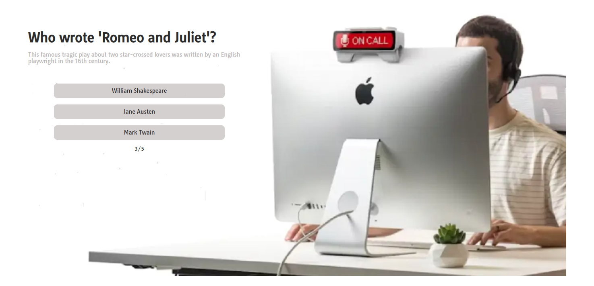
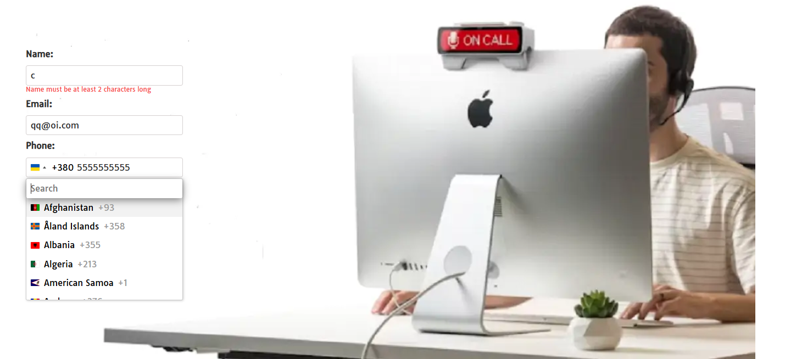

# Quiz App

## Overview

This project is a dynamic and interactive Quiz Application built with React. It
leverages modern frontend technologies to provide a seamless user experience,
including form handling, validation, responsive design, and notifications.

## Technologies Used

-React (react, react-dom) - Core library for building the user interface.

-React Hook Form (react-hook-form) - Efficient form management.

-Yup (yup) - Form validation schema.

-Axios (axios) - HTTP requests handling.

-Intl-Tel-Input (intl-tel-input) - International phone number input support.

-Clsx (clsx) - Conditional class name utility.

-Modern Normalize (modern-normalize) - CSS reset for consistent styling.

-React Icons (react-icons) - SVG icons for UI enhancement.

-Responsive (react-responsive) - Responsive design utilities.

-React Hot Toast (react-hot-toast) - Toast notifications.

-Hook Form Resolvers (@hookform/resolvers) -Connects yup to react-hook-form for
validation.

## 

## 

## Demo

- [Deployed on Vercel](https://test-task-sigma-pied.vercel.app)
- [GitHub Repository](https://github.com/Mariia-Petlovana-91/test-task)
